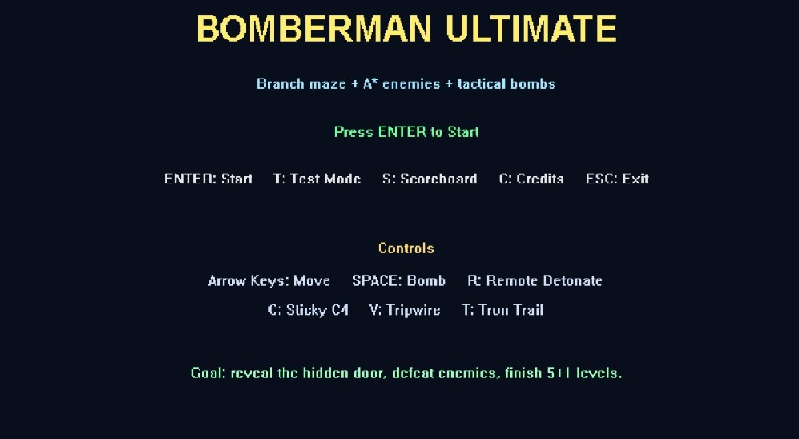
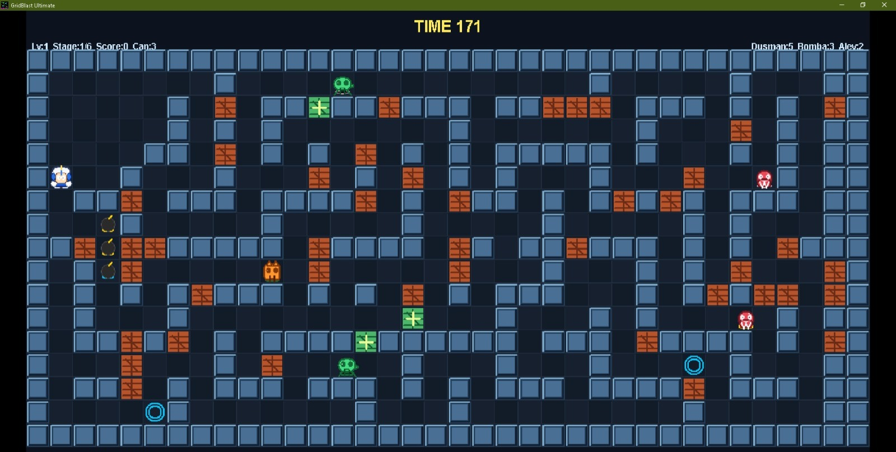
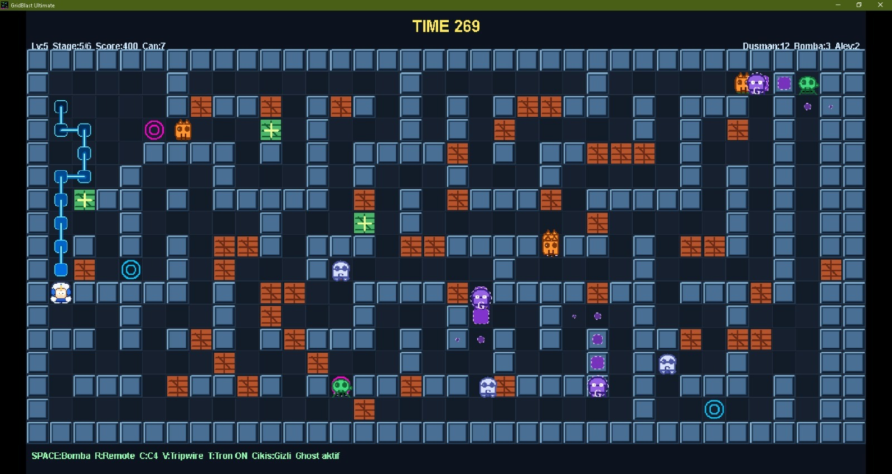
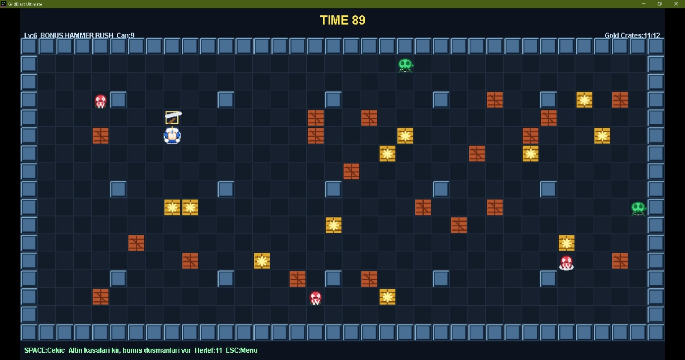

# GridBlast Ultimate

**GridBlast Ultimate** is a C++ Win32 grid-based action game developed as an academic Game Programming course project.

The game uses a tile/grid map, procedural maze generation, destructible walls, enemy AI, A* pathfinding, normal bombs, Sticky C4, tripwire mines, trail-based obstacles, Ghost Puller enemies, a Bonus Hammer Rush mode, sound effects, and a scoreboard system.

> **Copyright / naming note:** This repository avoids using commercial franchise assets, sprites, logos, music, character names, or official resources. The project is presented as an original academic prototype inspired by general grid-based maze action mechanics. The source title text has also been renamed to **GridBlast Ultimate** for safer public GitHub presentation.

---

## Screenshots

The following screenshots were captured from the running Windows build.

### Main Menu



> Note: the provided captured menu screenshot may still show the previous internal title text. In the repository source, the menu title string was updated to **GRIDBLAST ULTIMATE** in `GridBlastUltimate.cpp`. For the final public GitHub version, recapture this screen after rebuilding if you want the screenshot title to match the updated project name exactly.

### Normal Gameplay



### Advanced Mechanics: Tripwire, Ghost Trail, Enemies and Power-ups



### Bonus Hammer Rush Mode



---

## Main Features

- C++ Win32 game project based on a course game-engine structure
- 16:9 tile/grid-based gameplay area
- 5 normal levels + 1 bonus mode
- Procedural branch-style maze generation
- Breakable walls and hidden exit gate
- Power-ups such as bomb capacity, explosion range, speed, shield, and wall-pass
- Multiple enemy behavior types:
  - Wanderer
  - Runner
  - Hunter
  - Spooky
  - Ghost Puller
- A* pathfinding for selected enemy types
- Normal bomb system with controlled ray-based explosion propagation
- Sticky C4 projectile mechanic
- Tripwire / mine-line mechanic
- Tron trail obstacle mechanic
- Ghost trail mechanic
- Bonus Hammer Rush mode
- Scoreboard and run-complete name entry
- MIDI background music and WAV sound effects
- Test mode for fast gameplay demonstration

---

## Controls

| Key | Action |
|---|---|
| Arrow Keys | Move player / set facing direction |
| Space | Drop normal bomb / hammer attack in bonus mode |
| R | Remote detonation |
| C | Throw Sticky C4 |
| V | Place tripwire anchor |
| T | Use Tron trail mechanic |
| ESC | Return to main menu |
| Enter | Confirm menu selection / name entry |

---

## Technical Overview

The game-specific implementation is mainly located in:

```text
GridBlastUltimate.cpp
GridBlastUltimate.h
```

The course engine layer is kept separate:

```text
GameEngine.cpp
GameEngine.h
```

Important game systems:

| System | Main Functions / Areas |
|---|---|
| Game flow | `NewGame`, `NewTestGame`, `NextLevel`, `CompleteRun` |
| Level generation | `GenerateLevel`, `GenerateBranchingMaze`, `PlaceBreakableWalls`, `PlaceExitGate` |
| Player movement | `TryMovePlayer`, `IsPlayerWalkable`, smooth transition fields |
| Enemy system | `PlaceEnemies`, `SelectEnemyTypeForLevel`, `ConfigureEnemyByType`, `UpdateEnemies` |
| A* pathfinding | `FindNextStepAStar`, `IsAStarWalkable`, `GetAStarChanceForEnemy`, `GetAStarRangeForEnemy` |
| Bomb system | `DropBomb`, `UpdateBombs`, `ExplodeBomb`, `AddExplosionRay` |
| C4 system | `ThrowStickyC4`, `UpdateStickyBombs`, `MoveStickyBomb` |
| Tripwire system | `PlaceTripwireAnchor`, `UpdateTripwire`, `ExplodeTripwireCell` |
| Trail mechanics | `UpdateTronTrail`, `IsTronTrailCell`, `UpdateGhostTrail`, `IsGhostTrailCell` |
| Bonus mode | `StartBonusHammerRush`, `PerformHammerAttack`, `HitBonusCell` |
| Score system | `GetEnemyScoreValue`, `AwardLevelClearBonus`, `SaveScore` |

---

## Current Stable Base

This GitHub-ready version is based on the latest stable project package:

```text
v26 - Movement, Explosion and Tripwire Fix
```

Main fixes included:

- Player movement waits for transition frames more consistently.
- Bomb and C4 explosions use grid-based ray propagation.
- Solid walls stop explosion propagation.
- Breakable walls are destroyed, but the explosion does not continue behind them.
- Enemies behind walls or outside the valid explosion range should not be damaged.
- Tripwire placement checks walls, breakable walls, bombs, enemies, and active tripwire limits.
- Tripwire explosion affects only the tripwire line instead of creating a full bomb blast from every tripwire cell.

---

## Build Requirements

- Windows
- Visual Studio 2022
- Desktop development with C++ workload
- Win32 target support

The project uses:

- Win32 API
- GDI drawing
- `winmm.lib` for MIDI/WAV playback
- `msimg32.lib` for drawing support

---

## Build Instructions

1. Clone or download the repository.
2. Open the solution:

```text
GridBlastUltimate.sln
```

3. Select:

```text
Configuration: Debug or Release
Platform: Win32
```

4. Build the project:

```text
Build > Clean Solution
Build > Rebuild Solution
```

5. Run the project from Visual Studio.

---

## Repository Structure

```text
GridBlast-Ultimate/
├── GridBlastUltimate.cpp
├── GridBlastUltimate.h
├── GridBlastUltimate.sln
├── GridBlastUltimate.vcxproj
├── GridBlastUltimate.vcxproj.filters
├── GameEngine.cpp
├── GameEngine.h
├── Resource.h
├── GridBlastUltimate.rc
├── Music.mid
├── *.wav
├── assets/
│   └── screenshots/
│       ├── 01-main-menu.png
│       ├── 02-gameplay-level.png
│       ├── 03-advanced-mechanics.png
│       └── 04-bonus-hammer-rush.png
├── docs/
│   ├── project-overview-tr.md
│   ├── code-control-guide-tr.md
│   ├── function-summary-tr.md
│   ├── explosion-fix-note-tr.txt
│   ├── movement-explosion-tripwire-fix-note-tr.txt
│   └── screenshot-capture-guide-tr.md
├── README.md
├── NOTICE.md
└── .gitignore
```

---

## Documentation

Additional Turkish documentation is available under the `docs/` folder:

- `project-overview-tr.md`
- `code-control-guide-tr.md`
- `function-summary-tr.md`
- `explosion-fix-note-tr.txt`
- `movement-explosion-tripwire-fix-note-tr.txt`
- `screenshot-capture-guide-tr.md`

These files are useful for academic code review and project explanation.

---

## Academic Scope

This project was developed for educational purposes as a Game Programming course project. It demonstrates Win32 game-loop usage, grid-based gameplay logic, procedural map creation, enemy behavior design, A* pathfinding, collision rules, custom gameplay mechanics, and technical documentation for code review.
