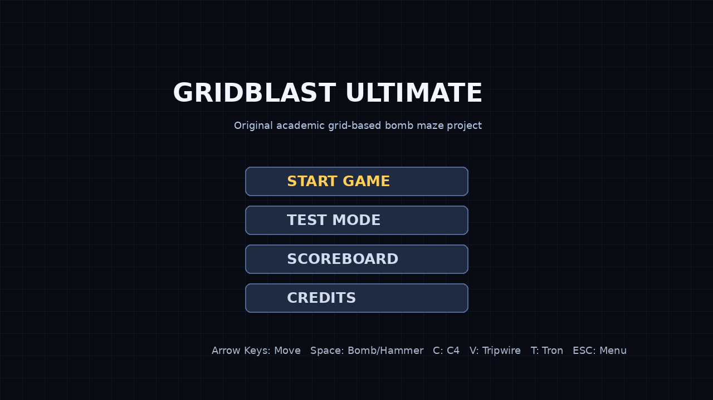
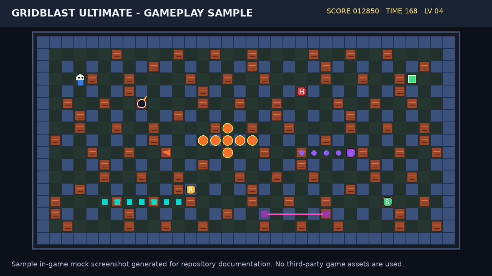
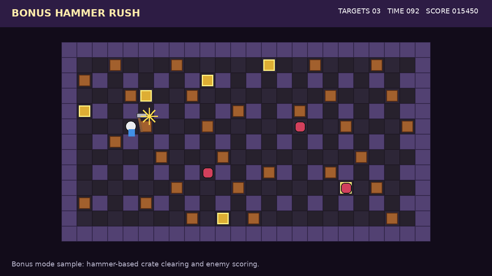
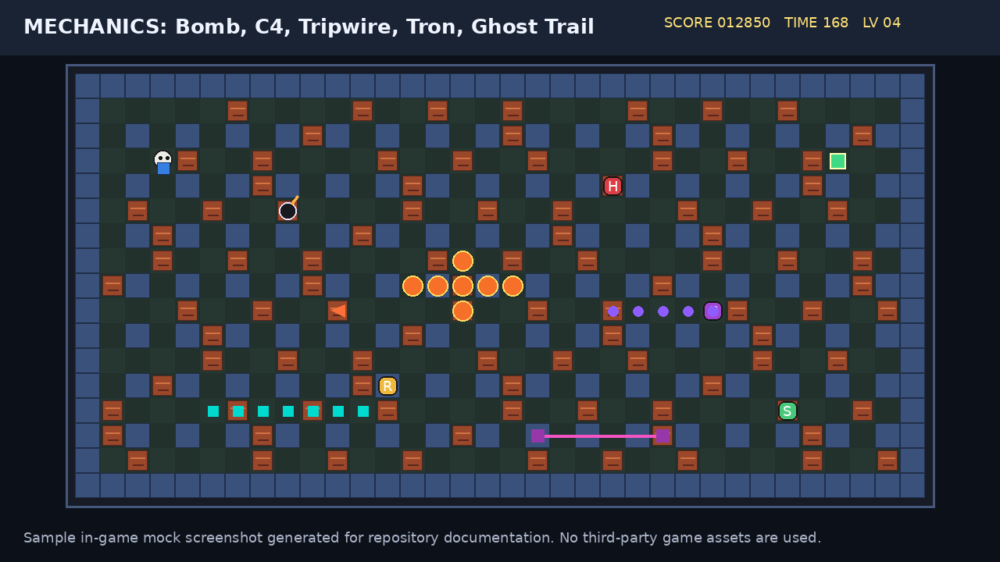

# GridBlast Ultimate

**GridBlast Ultimate** is an academic Win32/C++ grid-based bomb-maze game developed on top of the course game-engine structure. The project is inspired by the general mechanics of classic tile-based bomb maze games, but it uses its own title, procedural visuals, custom gameplay rules, and no third-party commercial game assets.

> Copyright / naming note: This repository intentionally avoids using the title, character names, sprites, logos, music, or original assets of any commercial game franchise. The project is a course prototype with original mechanics and educational code documentation.

---

## Screenshots

The images below are repository documentation screenshots / gameplay mockups prepared to show the current UI and mechanics style. They do not contain third-party commercial game assets.

### Main Menu


### Gameplay Sample


### Bonus Hammer Rush


### Mechanics Overview


---

## Main Features

- 5 normal levels + 1 bonus level
- 16:9 grid-based level layout
- Randomized branch-style map generation
- Breakable walls, hidden exit gate, and power-ups
- Multiple enemy archetypes:
  - Wanderer
  - Runner
  - Hunter
  - Spooky
  - Ghost Puller
- A* pathfinding for selected enemy types
- Balanced enemy count, speed, tracking chance, and tracking range per level
- Normal bomb system with fixed ray-based explosion rules
- Sticky C4 projectile bomb
- Tripwire / mine-line system
- Tron trail mechanic
- Ghost trail mechanic
- Bonus Hammer Rush mode
- Scoreboard and run-complete name entry
- MIDI background music + WAV sound effects
- Test mode for quick feature demonstration

---

## Controls

| Key | Action |
|---|---|
| Arrow Keys | Move player / choose facing direction |
| Space | Drop normal bomb / hammer attack in bonus mode |
| R | Remote bomb detonation |
| C | Throw Sticky C4 |
| V | Place tripwire anchor |
| T | Toggle / use Tron trail mechanic |
| ESC | Return to main menu |
| Enter | Select menu item / confirm name |

---

## Technical Overview

The game logic is mainly implemented in:

- `GridBlastUltimate.cpp`
- `GridBlastUltimate.h`

The course engine layer is kept separate:

- `GameEngine.cpp`
- `GameEngine.h`

Important game systems:

| System | Main Functions / Areas |
|---|---|
| Level flow | `NewGame`, `NewTestGame`, `GenerateLevel`, `NextLevel` |
| Map generation | `GenerateBranchingMaze`, `PlaceBreakableWalls`, `PlaceExitGate` |
| Player movement | `TryMovePlayer`, `IsPlayerWalkable`, smooth transition fields |
| Enemy AI | `PlaceEnemies`, `UpdateEnemies`, `ConfigureEnemyByType` |
| Pathfinding | `FindNextStepAStar`, `IsAStarWalkable`, `GetAStarChanceForEnemy` |
| Bombs | `DropBomb`, `UpdateBombs`, `ExplodeBomb`, `AddExplosionRay` |
| C4 | `ThrowStickyC4`, `UpdateStickyBombs`, `MoveStickyBomb` |
| Tripwire | `PlaceTripwireAnchor`, `UpdateTripwire`, `ExplodeTripwireCell` |
| Tron trail | `UpdateTronTrail`, `IsTronTrailCell` |
| Ghost trail | `UpdateGhostTrail`, `IsGhostTrailCell`, `ApplyGhostPull` |
| Bonus mode | `StartBonusHammerRush`, `PerformHammerAttack`, `CompleteRun` |

---

## Current Stable Fixes

This repository is based on the latest stable course-project package:

`v26 - Movement, Explosion and Tripwire Fix`

Included fixes:

- Player movement no longer interrupts transition frames aggressively.
- Normal bomb and C4 explosion logic uses proper ray-based range limits.
- Solid walls stop explosion propagation.
- Breakable walls are destroyed, but explosion does not continue behind them.
- Enemies outside the explosion range or behind walls should not be damaged.
- Tripwire / mine placement checks wall, breakable wall, bomb, enemy, and active tripwire limits.
- Tripwire explosion affects only the tripwire line, not a full bomb blast from every tripwire cell.

---

## Build Instructions

### Requirements

- Windows
- Visual Studio 2022
- Desktop development with C++ workload
- Win32 target support

### Build Steps

1. Clone or download this repository.
2. Open `GridBlastUltimate.sln` in Visual Studio.
3. Select:
   - Configuration: `Debug` or `Release`
   - Platform: `Win32`
4. Run:
   - **Build > Clean Solution**
   - **Build > Rebuild Solution**
5. Start the project.

The project links against:

- `winmm.lib` for MIDI/WAV sound playback
- `msimg32.lib` for Win32 drawing support

---

## Repository Structure

```text
GridBlast_Ultimate/
├── GridBlastUltimate.cpp
├── GridBlastUltimate.h
├── GridBlastUltimate.sln
├── GridBlastUltimate.vcxproj
├── GameEngine.cpp
├── GameEngine.h
├── Resource.h
├── GridBlastUltimate.rc
├── Music.mid
├── *.wav
├── assets/
│   └── screenshots/
├── docs/
│   ├── project-overview-tr.md
│   ├── code-control-guide-tr.md
│   ├── function-summary-tr.md
│   ├── explosion-fix-note-tr.txt
│   └── movement-explosion-tripwire-fix-note-tr.txt
├── README.md
├── NOTICE.md
└── .gitignore
```

---

## Academic Presentation Notes

For code review, focus on the following explanation:

> The course engine lifecycle is preserved. The game-specific logic is implemented on top of the engine callbacks. The level is represented as a tile grid; map generation creates a connected branch-like maze, enemies use different behavior profiles, selected enemies use A* pathfinding, and the bomb system is implemented through controlled explosion cells. Additional mechanics such as Sticky C4, tripwire mines, Tron trail, Ghost Puller trail, and Hammer Rush bonus mode extend the base grid gameplay.

---

## Copyright and Asset Notice

This project is an educational prototype. It does not include sprites, logos, character designs, music, sound effects, or other assets copied from any commercial bomb-maze game franchise. The name **GridBlast Ultimate** is used to avoid trademark confusion.

If this repository is published publicly, keep the project description as an academic, non-commercial course project and avoid using commercial franchise names in the repository title, package title, images, or release text.
